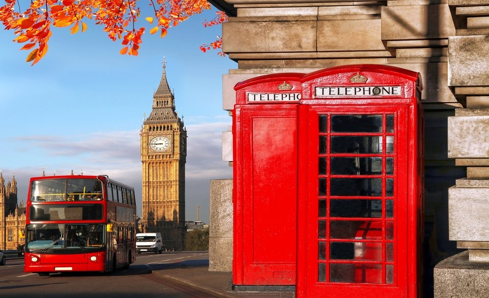
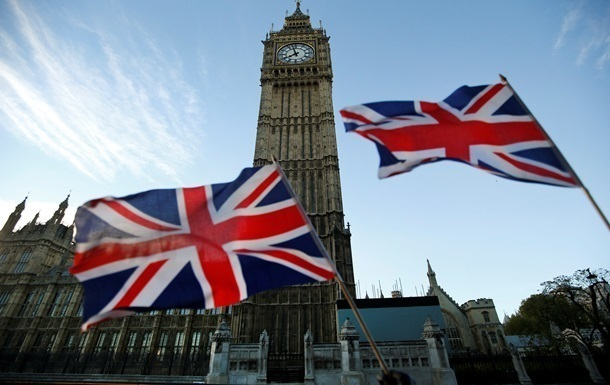
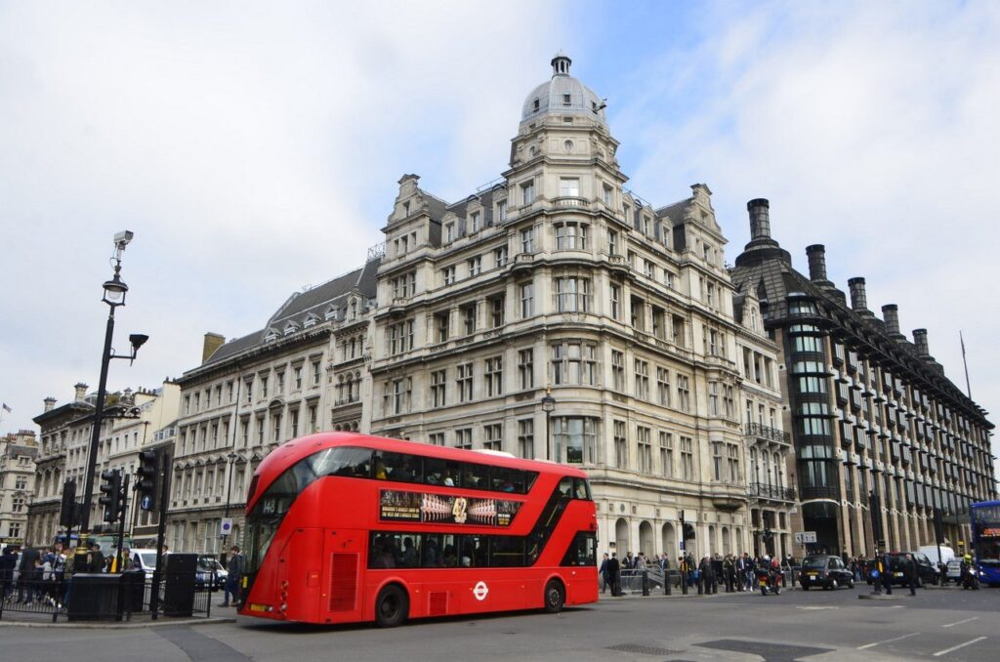

<!DOCTYPE html>
<html lang="en">
<head>
    <meta charset="UTF-8">
    <meta name="viewport" content="width=device-width, initial-scale=1.0">
    <title>Document</title>
    
</head>

<body>
    <h1 align="center" > Culture of Great Britain  </h1>
    
The culture of the United Kingdom is rich and diverse. It significantly influences culture on a global scale. Within the state, it is also divided  into the unique cultures of the kingdoms that make up it: the culture of England, the culture of Wales, the culture of Scotland, the culture of Ireland. The UK has strong cultural ties to its former colonies, especially those countries where English is the official language. Some English musical performers  have had a significant influence on the development of music in the world (The Beatles). Immigrants from the Indian subcontinent and the Caribbean have made a significant  contribution to British culture over the past half century. The cultures of former independent states were incorporated into the UK as it was formed, so they can also be considered separately. 

    
In the UK, English is the main means of communication and the de facto official language, as 95% of the population speaks only English.

        Bilingualism in the UK
        However, some nationalities and regions of the UK promote their native languages ​​(Welsh, Scots (Gaelic and Anglo-Scottish), Cornish and Irish) through the media, education and official documentation. The UK authorities strongly encourage the development, popularization and preservation of national minority languages.
        
        Due to its ease of learning and extreme prevalence, English is recognized as the language of international communication. In schools in most countries of the world, English is a mandatory foreign language to study. 

    
Folklore is diverse. It is of great importance in the life of many European countries [source not specified for 617 days].
        

        English  folk music
        In English folk music, as in Russian folk music, the emphasis is on vocals, which are usually male and polyphonic. Musical   instruments are the violin, accordion, whistle, drum, and in Northumberland, the bagpipe. Folk dances are very well developed - the perky and cheerful  hornpipe and jig,the fertility dance morris.
        
        Among the  songs there are carols  - Christmas songs, similar to  carols, shanties - sailor songs,  ballads, children's songs  (Children's   rhyme),  known in Russia from the translations of Samuil Marshak and Korney Chukovsky.  The most famous English folk song is "Greensleeves", known since the 16th century. 

    
    
    
</body>
</html>
